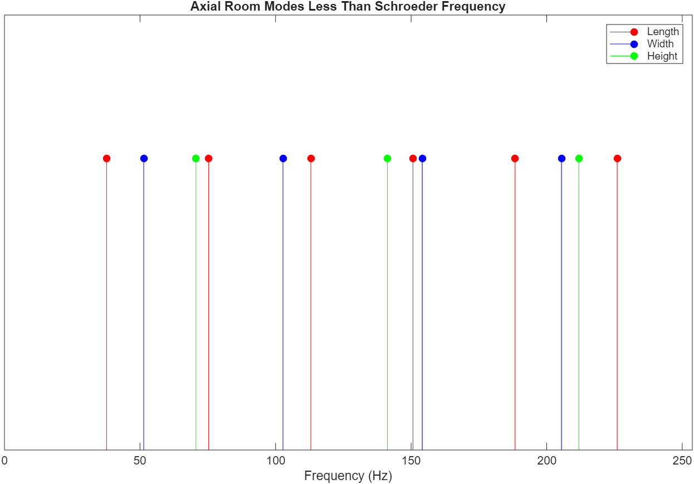
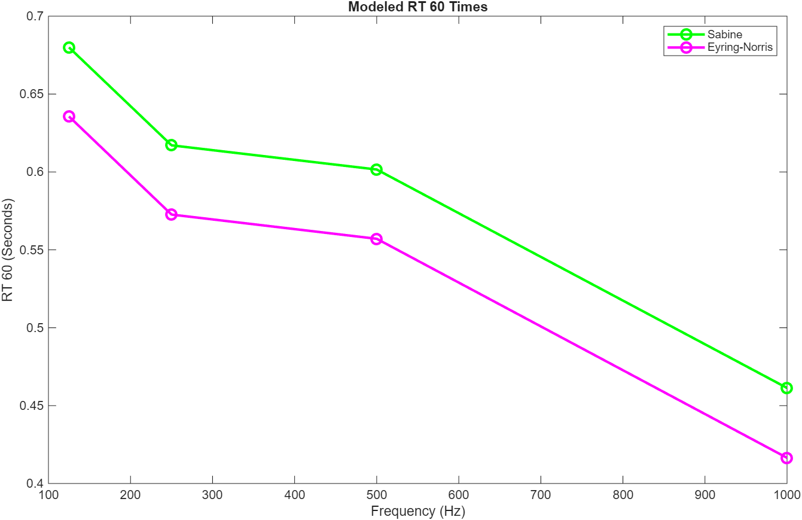
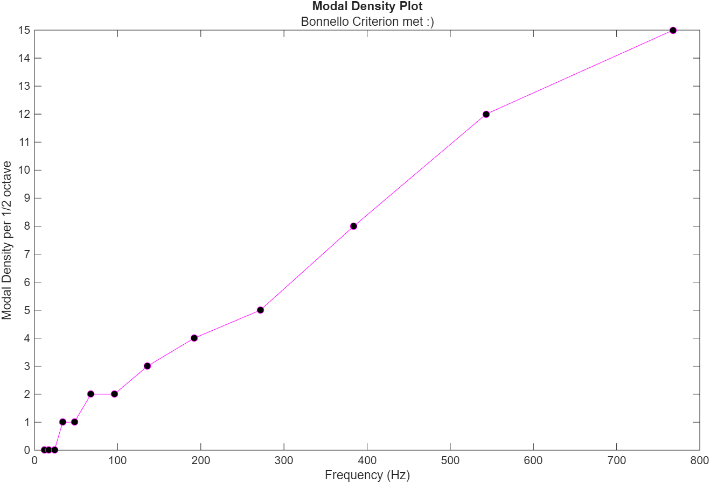

# Acoustical Studio Analysis

A comprehensive acoustical analysis of a home production/mixing studio, combining theoretical modeling, empirical measurements, and data-driven treatment recommendations.

## Project Overview

This project presents a complete acoustical assessment of an 11′×15′×8′ home studio located in a residential apartment in South Miami. The analysis integrates:

- **Mathematical modeling** of room acoustics using MATLAB
- **Empirical measurements** using Room EQ Wizard (REW)
- **Data processing** to correlate predictions with measurements
- **Evidence-based treatment recommendations** balancing acoustic performance with budget constraints

## Key Findings

- Identified modal resonances at **70 Hz and 150 Hz** matching theoretical predictions
- Measured **RT60 times** showing elevated decay in low frequencies (<125 Hz) and unexpected rise at 1 kHz
- Proposed **$148 budget-friendly treatment plan** targeting mid-frequency reflections and low-frequency modal buildup
- Predicted **marked improvement across frequency spectrum**, especially at the 500 Hz benchmark

## Repository Structure
```
acoustical-report/
├── acoustics_projectsimulations.m     # MATLAB simulations (modal analysis, RT60 predictions)
├── rt_60_average.py                   # Python script to average RT60 measurement exports
├── RT60_averaged.csv                  # Aggregated RT60 data from measurements
├── MUE606_Acoustical_Report.pdf       # Complete technical report
├── report_figures/                    # Figures used in the final report
├── rew_measurements/                  # Raw measurement exports from Room EQ Wizard
└── rt60_measurement_exports/          # Individual RT60 measurement text files
```

## Technical Approach

### 1. Acoustical Simulation (MATLAB)
- **Room mode analysis**: Axial mode distribution below Schroeder frequency (253.71 Hz)
- **Bolt area analysis**: Verified room dimensions fall within recommended ratios
- **RT60 prediction**: Calculated using Sabine and Eyring-Norris equations
- **First reflection analysis**: Modeled comb filtering from ceiling, floor, and rear wall reflections
- **Modal density**: Evaluated convergence to Bonnello criterion

<p align= 'center'>
  
  
  
  <em> Modeled axial modes below Schroeder frequency (top), RT 60 times (middle), and modal density plot (below)</em>
</p>


### 2. Empirical Measurements (REW)
- **Equipment**: 
  - Source: ADAM Audio T7V studio monitor
  - Receiver: miniDSP U-MIK-1 omnidirectional microphone
- **Methodology**: 
  - 3×3 grid receiver measurement pattern (9 positions)
        -Centered around 4-foot distance from source
  - 1-foot source distance from front wall
  - RMS averaging of SPL readings
- **Metrics**: EDT, T20, T30 estimates of RT60

### 3. Data Processing (Python)
- Automated averaging of RT60 measurements across multiple positions
- Export to CSV for further analysis and visualization

<p align = 'center'>
  
  <em> Averaged RT 60 measurements</em>
</p>

## Usage

### Running MATLAB Simulations
```matlab
% Open MATLAB and run:
acoustics_projectsimulations.m
```
This will generate:
- Room mode distribution plots
- RT60 prediction curves
- Bolt area visualization
- First reflection analysis

### Processing RT60 Measurements
```bash
# Navigate to rt60_measurement_exports directory
cd rt60_measurement_exports

# Run Python averaging script
python ../rt_60_average.py
```
**Note**: The script must be run from within the `rt60_measurement_exports` folder to properly locate the measurement files.

## Treatment Recommendations

Based on the analysis, the following treatments were recommended:

1. **Mid-frequency absorption** (targeting 1 kHz decay):
   - Properly mount existing tapestries (3/4 coverage)
   - Add Audimute absorptive sheets (NRC = 0.85) to doorways/openings ($69)

2. **Low-frequency modal control** (targeting 70 Hz and 150 Hz):
   - Strategic monitor placement away from walls/corners
   - REW-guided critical listening position selection
   - 1-2 GIK Acoustics bass traps (2′×2′, 4″ thickness, $79)

**Total cost**: $148

## Tools & Technologies

- **MATLAB**: Room acoustics modeling and simulation
- **Room EQ Wizard (REW)**: Acoustic measurements and analysis
- **Python**: Data processing and averaging
- **miniDSP U-MIK-1**: Omnidirectional measurement microphone
- **ADAM Audio T7V**: Studio reference monitor

## Results

Predicted post-treatment improvements:
- Flatter frequency response, especially at 500 Hz benchmark
- Reduced modal buildup at 70 Hz and 150 Hz
- Decreased RT60 times at 1 kHz
- More accurate critical listening environment

See full report (`MUE606_Acoustical_Report.pdf`) for detailed analysis and visualizations.

## Author

**Sahan Wijewardane**  
MS Music Engineering Technology  
University of Miami, Frost School of Music


---

*This project demonstrates practical application of acoustical engineering principles, combining theoretical modeling with empirical validation for real-world studio optimization.*
